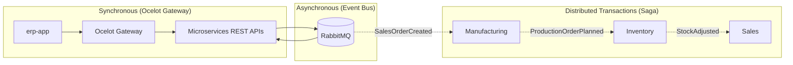
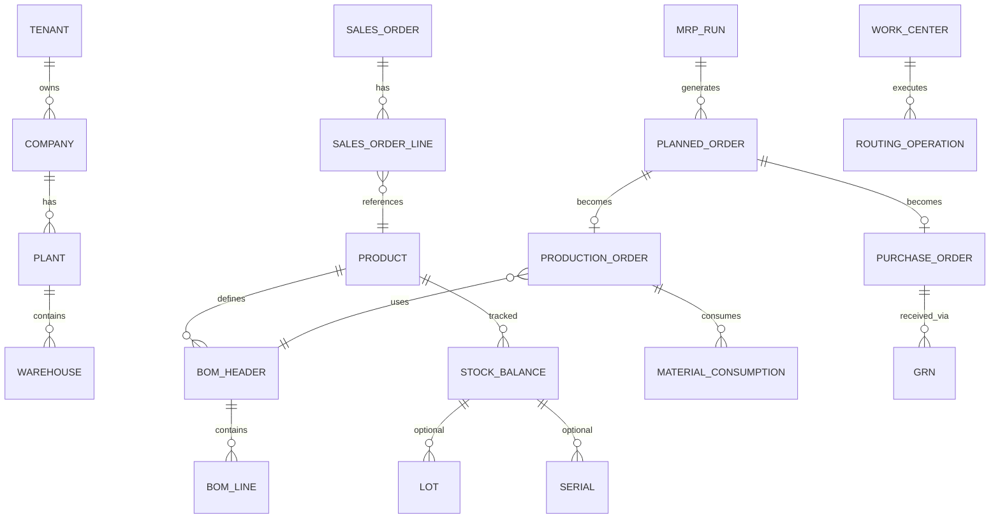
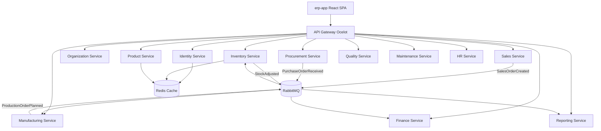
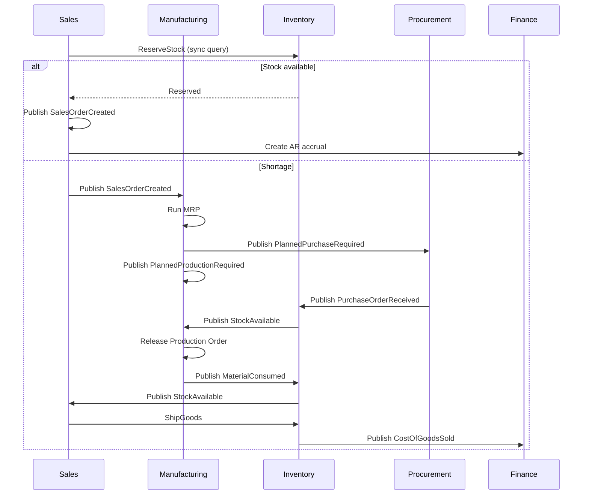
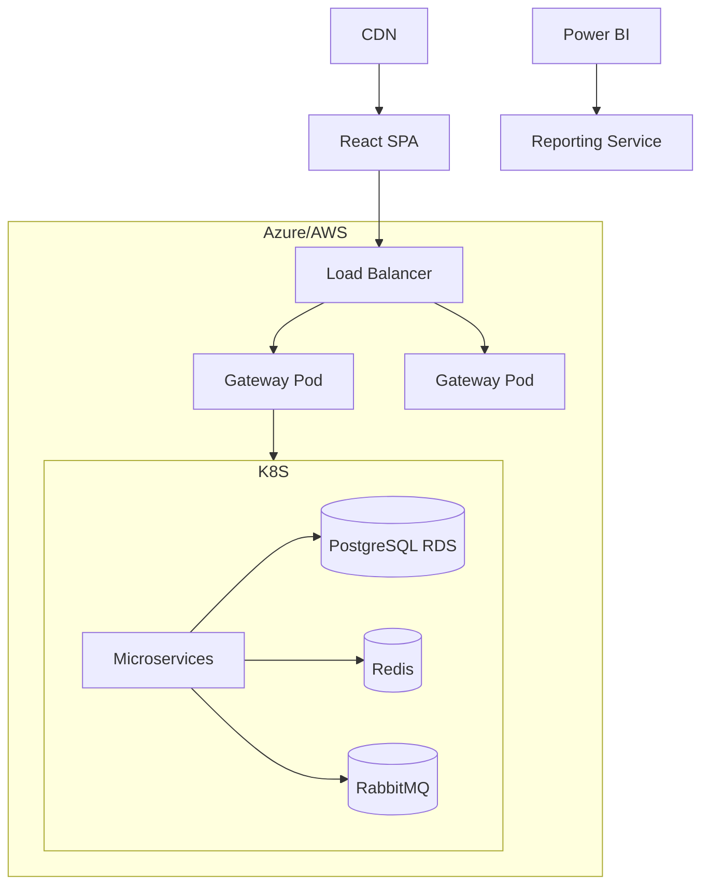

# Enterprise Manufacturing ERP — Architecture

Enterprise-grade microservices ERP aligned with SAP PP/MM, Oracle SCM, Dynamics 365 Supply Chain, and Odoo Manufacturing patterns.

## Architecture Principles

| Pattern | Role in this solution |
|---------|------------------------|
| **Microservices Architecture** | 12 bounded-context services (Identity, Product, Inventory, Sales, etc.), each with its own PostgreSQL database, Clean Architecture layers, and independent deployability behind **Ocelot API Gateway**. |
| **Event-Driven Architecture** | Domain changes propagate asynchronously via **RabbitMQ + MassTransit** integration events (`BuildingBlocks.EventBus`). Services publish facts; consumers react without tight coupling. |
| **Saga Pattern** | Long-running distributed workflows (Order-to-Cash, Procure-to-Pay, MRP) use **choreography-based sagas**: each service listens for events, performs local transactions, and publishes compensating or forward events (see section 7). |



## 1. Solution Folder Structure

```
Enterprise/
├── docs/architecture/          # Architecture artifacts (this folder)
├── docker/                     # Docker Compose, Dockerfiles
├── frontend/                   # Points to repo-root erp-app (canonical UI)
├── src/
│   ├── BuildingBlocks/         # Shared domain, application, infrastructure, event bus
│   ├── Gateway/                # Ocelot API Gateway
│   └── Services/
│       ├── Identity.*          # Auth, users, roles, permissions, refresh tokens
│       ├── Organization.*      # Companies, plants, warehouses, departments
│       ├── Product.*           # Product master, categories, variants, SKU
│       ├── Inventory.*         # Stock, transfers, cycle count, valuation
│       ├── Procurement.*       # Vendors, PR, RFQ, PO, GRN
│       ├── Sales.*             # Customers, quotes, SO, invoices, shipments
│       ├── Manufacturing.*     # BOM, routing, MRP, production orders
│       ├── Quality.*           # Inspection plans, NCR
│       ├── Maintenance.*       # Equipment, PM, breakdown WO
│       ├── HR.*                # Employees, attendance, payroll, leave
│       ├── Finance.*           # GL, AP, AR, costing
│       └── Reporting.*         # KPIs, Power BI integration
├── tests/
│   ├── Identity.UnitTests/
│   └── Identity.IntegrationTests/
└── Enterprise.sln
```

Each microservice follows **Clean Architecture**:

```
{Service}.Domain/         → Entities, aggregates, repository interfaces, domain events
{Service}.Application/  → CQRS commands/queries, handlers, validators, DTOs
{Service}.Infrastructure/ → EF Core, repositories, external integrations
{Service}.API/            → Controllers, middleware, DI composition root
```

---

## 2. Database Design

**Strategy:** Database-per-service (PostgreSQL), multi-tenant via `tenant_id` column + row-level security.

| Service | Database | Key Tables |
|---------|----------|------------|
| Identity | `erp_identity` | tenants, users, roles, permissions, user_roles, role_permissions, refresh_tokens |
| Organization | `erp_organization` | companies, plants, warehouses, departments, cost_centers |
| Product | `erp_product` | products, categories, variants, skus, product_images |
| Inventory | `erp_inventory` | stock_balances, stock_transactions, lots, serials, transfers |
| Procurement | `erp_procurement` | vendors, requisitions, rfqs, purchase_orders, grns |
| Sales | `erp_sales` | customers, quotations, sales_orders, invoices, shipments |
| Manufacturing | `erp_manufacturing` | boms, routings, work_centers, production_orders, material_consumptions |
| Quality | `erp_quality` | inspection_plans, inspections, ncrs |
| Maintenance | `erp_maintenance` | equipment, maintenance_plans, work_orders |
| HR | `erp_hr` | employees, attendance, shifts, payroll_runs, leave_requests |
| Finance | `erp_finance` | chart_of_accounts, journal_entries, ap_invoices, ar_invoices |
| Reporting | `erp_reporting` | report_definitions, kpi_snapshots, etl_watermarks |

**Cross-cutting columns:** `id`, `tenant_id`, `company_id`, `plant_id`, `created_at_utc`, `created_by`, `modified_at_utc`, `modified_by`, `is_deleted`.

---

## 3. ER Diagram (Core Manufacturing)



---

## 4. Microservice Communication Diagram



**Sync:** REST via Gateway for queries and command submission.  
**Async:** RabbitMQ + MassTransit for domain/integration events.  
**Saga:** Choreography for Order-to-Cash and Procure-to-Pay (see section 7).

---

## 5. API Contracts

Base URL: `https://api.erp.local` (Gateway)

| Service | Base Path | Example |
|---------|-----------|---------|
| Identity | `/api/v1/auth` | `POST /login`, `POST /refresh`, `GET /me` |
| Organization | `/api/v1/organization` | `GET /companies`, `POST /plants` |
| Product | `/api/v1/products` | `GET /`, `POST /`, `GET /{id}/variants` |
| Inventory | `/api/v1/inventory` | `GET /stock`, `POST /transfers` |
| Procurement | `/api/v1/procurement` | `POST /purchase-orders`, `POST /grn` |
| Sales | `/api/v1/sales` | `POST /orders`, `POST /shipments` |
| Manufacturing | `/api/v1/manufacturing` | `POST /production-orders`, `POST /mrp/run` |
| Quality | `/api/v1/quality` | `POST /inspections` |
| Maintenance | `/api/v1/maintenance` | `POST /work-orders` |
| HR | `/api/v1/hr` | `GET /employees`, `POST /attendance` |
| Finance | `/api/v1/finance` | `POST /journal-entries` |
| Reporting | `/api/v1/reporting` | `GET /dashboard/kpis` |

All authenticated endpoints require `Authorization: Bearer {access_token}` and `X-Tenant-Id` header.

---

## 6. RabbitMQ Events

| Event | Publisher | Consumers |
|-------|-----------|-----------|
| `SalesOrderCreatedIntegrationEvent` | Sales | Manufacturing, Inventory, Finance |
| `MrpRunCompletedIntegrationEvent` | Manufacturing | Procurement, Inventory, Reporting |
| `ProductionOrderReleasedIntegrationEvent` | Manufacturing | Inventory, Quality, Finance |
| `MaterialConsumedIntegrationEvent` | Manufacturing | Inventory, Finance |
| `PurchaseOrderReceivedIntegrationEvent` | Procurement | Inventory, Finance |
| `StockAdjustedIntegrationEvent` | Inventory | Manufacturing, Sales, Reporting |
| `GoodsShippedIntegrationEvent` | Sales | Inventory, Finance |
| `InspectionFailedIntegrationEvent` | Quality | Manufacturing, Inventory |
| `WorkOrderCompletedIntegrationEvent` | Maintenance | Finance, Reporting |
| `PayrollProcessedIntegrationEvent` | HR | Finance |

Event envelope: `{ eventId, tenantId, occurredOnUtc, eventType, payload }`.

---

## 7. Saga Workflow — Order to Cash + MRP



**Compensation:** If production fails → release reservation, cancel planned PO, notify Sales.

---

## 8. Security Design

| Layer | Mechanism |
|-------|-----------|
| Authentication | JWT access tokens (60 min) + refresh tokens (7 days, rotated) |
| Authorization | RBAC + permission claims (`permission: manufacturing.production.create`) |
| Multi-tenancy | `tenant_id` claim + EF global query filters |
| Transport | TLS 1.2+, mTLS between services (production) |
| Secrets | Azure Key Vault / HashiCorp Vault |
| Audit | Serilog structured logs + immutable audit trail per service |
| API Gateway | Ocelot routing, rate limiting (extensible), JWT passthrough, tenant headers |

---

## 9. Deployment Architecture



**Local dev:** `docker compose -f docker/docker-compose.yml up`

---

## 10. CI/CD Pipeline Design

```yaml
# .github/workflows/enterprise-ci.yml (design)
stages:
  - build: dotnet restore/build/test (all services)
  - analyze: SonarQube, security scan
  - package: Docker build per changed service
  - deploy-dev: Push to ACR/ECR, deploy to dev K8s
  - integration-test: Testcontainers (PostgreSQL, RabbitMQ, Redis)
  - deploy-staging: Blue/green deployment
  - deploy-prod: Manual approval gate
```

**Branch strategy:** GitFlow — `main` (prod), `develop` (integration), `feature/*`, `release/*`.

---

## Reference Implementation

The **Identity Service** is fully scaffolded with CQRS/MediatR, FluentValidation, JWT, refresh tokens, PostgreSQL, and unit/integration test projects.

Run Identity locally:

```bash
cd Enterprise
dotnet ef migrations add InitialCreate --project src/Services/Identity.Infrastructure --startup-project src/Services/Identity.API
dotnet run --project src/Services/Identity.API
```

Gateway: `dotnet run --project src/Gateway/Erp.Gateway` (Ocelot on `http://localhost:5000`)

---

## Migration from Monolith (`/ERP`)

The existing monolith at `D:/ERP` can be migrated service-by-service:

1. Extract Identity → Identity Service (done)
2. Extract Product/Manufacturing domain → Product + Manufacturing services
3. Replace SQL Server with PostgreSQL per service
4. Introduce RabbitMQ for MRP and order events
5. Point React frontend to Gateway
